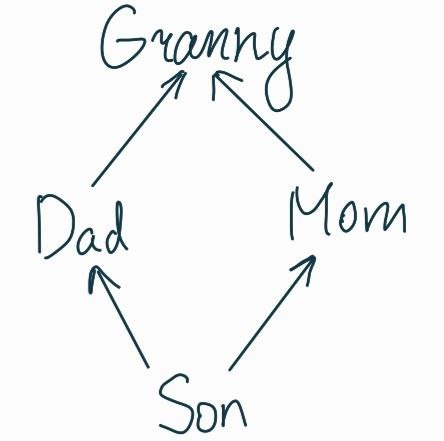
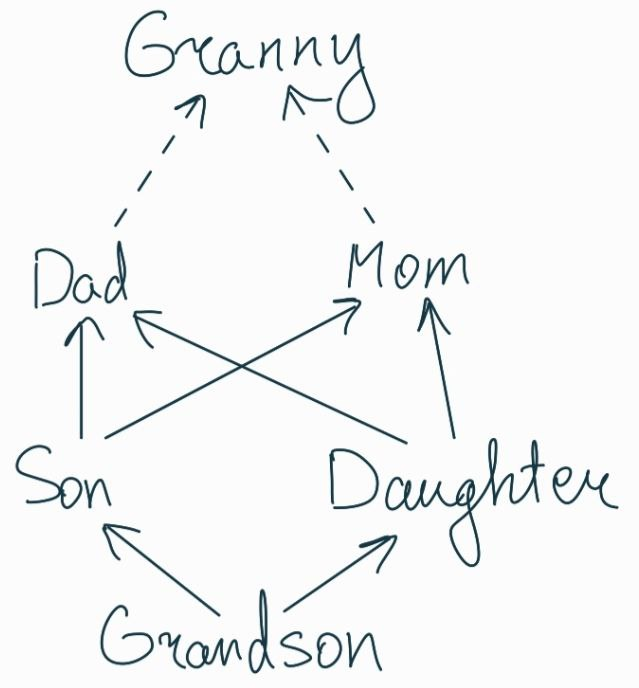

# 9

**Дисклеймер:** очень многое из того, что мы обсудим в рамках этого семинара, (никак не поддерживается стандартом)[https://eel.is/c++draft/class.derived.general#5]. Каждый компилятор вправе делать
свою реализацию со своей моделью того, как поддерживать наследование в C++, но мы изучим самую общую и рабочую модель.

**Зачем это изучать?** Язык C++ - это язык _среднего уровня_. Здесь можно писать как высокоуровневый код с какими-то умными контейнерами, так и гонять отдельные биты по памяти. Понимание того, что именно делает компилятор,
позволяет писать _оптимизируемый компилятором и операционной системой_ код. Плюс сможете отвечать насколько дорога та или иная строчка кода.

## Соглашение

Как можно найти в стандарте по ссылке в самом низу, при наследовании есть понятие _base class subobject_. Я буду называть это _объектом предка_ или же _базовым объектом_. Суть простая: те классы, от которых мы наследуемся,
на деле в объекте выглядят почти что как поля с соответствующими типами внутри.

_Самый дальний потомок (most derived class or object)_ - это тот класс, который мы рассматриваем и чей объект создаём (то есть все остальные объекты лежат внутри него).

## Статическое наследование

Статическое наследование - это обыкновенное наследование, возможно от нескольких предков.

**Пример:**
```c++
struct Base1 {
    int x1;
};

struct Base2 {
    int x2;
};

struct Derived : Base1, Base2 {
    int y;
};
```

### Порядок вызова конструкторов при множественном наследовании

Порядок инициализации всегда следующий ([ссылка на стандарт](https://eel.is/c++draft/class.base.init#13)):
 1. Инициализируем базовые объекты в порядке слева-направо согласно объявлению класса
 2. Инициализируем поля нашего объекта
 3. Выполняем конструктор

**Пример:** если брать иерархию классов выше, то `Derived d;` инициализируется в порядке `Base1`, `Base2`, `y` и потом уже тело конструктора `Derived`

### Размещение в памяти

Исходя из фиксированного стандартом порядка, можно понять, как компилятору _стоило бы_ класть объекты в память. Так как в любой момент у процессора есть некоторый указатель на память, который нужно сдвигать, то логично
класть объекты в том порядке, в котором они будут инициализироваться.

**Пример:** этот трюк стоит запомнить. Так всегда можно выяснить, как выложены классы при той или иной иерархии
```c++
#include <iostream>

struct Base1 {
    int b1;
};

struct Base2 {
    int b2;
};

struct Derived : Base1, Base2 {
    int d;
};

int main() {
    using ssize_t = signed long long int;
    Derived d;

    std::cout << "Derived ptr: " << &d << std::endl;
    std::cout << "Derived fields shift: " << (ssize_t)&d.d - (ssize_t)&d << std::endl;
    std::cout << "Derived's Base1 shift: " << (ssize_t)&static_cast<Base1&>(d) - (ssize_t)&d << std::endl;
    std::cout << "Derived's Base1 fields shift: " << (ssize_t)&static_cast<Base1&>(d).b1 - (ssize_t)&d << std::endl;
    std::cout << "Derived's Base2 shift: " << (ssize_t)&static_cast<Base2&>(d) - (ssize_t)&d << std::endl;
    std::cout << "Derived's Base2 fields shift: " << (ssize_t)&static_cast<Base2&>(d).b2 - (ssize_t)&d << std::endl;
}
```

Наблюдаем закономерную картину:
```
0                4                8                 12
|----------------|----------------|------------------|
|  Base1 fields  |  Base2 fields  |  Derived fields  |
|       b1       |       b2       |        d         |
|----------------|----------------|------------------|
|    Base1 obj   |    Base2 obj   |                  |
|----------------|----------------|                  |
|                      Derived obj                   |
|----------------------------------------------------|
```

### Проблема ромбовидного наследования

Есть 2 принципиально разные диаграммы:
 - Диаграмма наследований (классов). Представляет собой ориентированный граф на классах, где из `A` идёт ребро в `B`, если `A` - прямой потомок `B`
 - Диаграмма наследований (классов) в объекте. Представляет собой ориентированный граф на _(базовых) объектах внутри какого-то объекта_. Из объекта типа `A` идёт ребро в объект типа `B` (где `A` - прямой потомок `B`),
 если `A` содержит `B` в своей памяти.

Самый дальний наследник рисуется снизу, а дальше рёбра идут вверх. В диаграмме для объекта соблюдается порядок, в котором были отнаследованы классы (то есть слева-направо такой же вид, как и после двоеточия).

**Замечание:** я не знаю, известна ли вторая диаграмма где-то в мире, это было исходно придумано мной.

Рассмотрим теперь такую иерархию классов:



Если создать объект `Son s;`, то его иерархия будет выглядеть так:


Однако, иногда хочется _схлопнуть базовые объекты в один_, то есть чтобы создание объекта типа `Son` приводило к такой же по форме диаграмме, что и у классов. Текущий вариант наследования не позволяет это сделать.

**Пример:** в C++ [иерархия классов потоков](https://en.cppreference.com/w/cpp/io/basic_iostream) имеет именно недостающее наследование. Как это получается - смотрите дальше. 

### static_cast при множественном наследовании

Будем говорить, что каст происходит _вниз (downcast)_ или _вверх (upcast)_ в зависимости от того, в каком направлении происходит движение по диаграмме классов. (TL;DR; вниз - это к потомку, вверх - это к предку)

Как уже известно, наследники могут неявно (и явно через `static_cast`) приводиться к своим предкам. В более общем случае:
 1. Преобразование вверх всегда разрешено
 2. Преобразование вниз не может быть неявным, а в явном пользователь сам отвечает за его безопасность

**Пример:** здесь `static_cast` очевидно приводит к UB, потому что произойдёт обращение не к своей памяти.
```c++
#include <iostream>

struct A {
    int a;
};

struct B : A {
    int b;
};

int main() {
    A obj;

    std::cout << static_cast<B&>(obj).b << std::endl;  // UB
}
```

**Пример:** нельзя делать `static_cast` вбок по иерархии классов. При этом можно делать последовательные преобразования в несколько шагов до нужной цели
```c++
#include <iostream>

struct Granny {};

struct Dad : Granny {};
struct Mom : Granny {};

struct Son : Dad, Mom {};

int main() {
    Son s;

    Dad& d = s;
    static_cast<Mom&>(d);  // CE
    static_cast<Mom&>(static_cast<Son&>(d));  // OK
}
```

### Наследование с разными модификаторами доступа

Модификаторы доступа никак не влияют на структуру статического наследования. Естественно, все обращения к членам классов в конечном итоге будут проверены на доступность.

**Замечание:** внутри класса всегда есть неявные `using`'и на класс и его прямых предков. Важно отметить, что к квалифицированному таким образом имени будут применяться проверки на доступность именно изнутри определяемого
класса, а не те, которые могли быть выставлены в квалифицирующем классе.

**Пример:**
```c++
struct A {
    int x;
};

struct B : private A {
    int y;
};

struct C : B {
    void foo(const A& a) {  // CE: A is a private member of B
    }

    void g(const ::A& a) {  // OK
    }
};
```

### Поиск имён при множественном наследовании

Модификаторы доступа не влияют на поиск имён, он происходит раньше. Таким образом, наследнику видны абсолютно все объявления в базовых классах. Возникает закономерный вопрос: а что происходит, если у предков есть члены с
одинаковыми именами, или же в новом классе есть имя, повторяющее имя предка?

Вторая ситуация разрешается просто - происходит _перекрытие имён_. То есть, неквалифицированное обращение к этому члену будет относиться к самому нижнему по иерархии объявлению.

**Пример:**
```c++
struct Base1 {
    int x = 1;
};

struct Base2 {
    int x = 2;
};

struct Derived : Base1, Base2 {
    int y = 3;
};

int main() {
    Derived d;

    d.x;  // CE, ambiguous name
}
```

Компилятор поступает абсолютно закономерно, выдавая CE на обращение к неоднозначному имени. Есть 2 способа разрешить неоднозначность:
 1. Квалифицировать имя поля, чтобы поиск стал однозначным: `d.Base1::x;`. При этом можно указывать несколько имён классов-предков подряд, причём им не обязательно быть связанными напрямую: `object.A::B::C::x;`
 2. Сделать upcast к предку так, чтобы поиск стал однозначным

**Fun fact:** `::` - это отдельный не перегружаемый оператор. Не верите? Смотрите [первую строчку](https://en.cppreference.com/w/cpp/language/operator_precedence)

**Fun пример:** при следующей схеме наследования нельзя обратиться к предку, которого класс наследует напрямую. Единственный вариант - это `reinterpret_cast`, но это заведомо unspecified/UB в силу дисклеймера
```c++
struct Granny {
    int x = 10;
};

struct Mom : Granny {};

struct Son : Mom, Granny {
    void f() {
        Mom::x;       // OK
        x;            // CE, ambiguous
        Granny::x;    // CE, ambiguous
        ::Granny::x;  // CE, why???
    }
};
```
Диаграмма классов здесь выглядит так:


## Виртуальное наследование

Виртуальное наследование - это отдельный механизм наследования, позволяющий решить проблему ромбовидного наследования.

**Пример:**
```c++
struct Granny {};

struct Dad : virtual /*public*/ Granny {};

struct Mom : virtual /*public*/ Granny {};

struct Son : Dad, Mom {};
```

Теперь у объекта `Son` есть ровно один объект-предок `Granny`. Это также приводит к тому, что больше не нужно бороться с неоднозначностью обращений к членам `Granny`, ведь она одна и так же и для объекта `Dad`, и для
объекта `Mom`.

### Порядок вызовов конструкторов при виртуальном наследовании

Так как теперь несколько объектов могут ссылаться на общей объект-предок, то возникает закономерный вопрос: а кто и как инициализирует виртуальный базовый объект? Ответ прост: этим занимается самый дальник потомок, причём
неважно, являются ли эти виртуальные базовые классы его прямыми или косвенными потомками.

Полноценный порядок инициализации в итоге такой ([ссылка на стандарт](https://eel.is/c++draft/class.base.init#13)):
 1. Инициализируем виртуальные базовые объекты в порядке, в котором они встречаются при обходе графа наследования (из текущего класса обход идёт в прямых потомков согласно объявлению класса)
 2. Инициализируем базовые объекты в порядке слева-направо согласно объявлению класса
 2. Инициализируем поля нашего объекта
 3. Выполняем конструктор

### Виртуальное наследование в диаграммах

Чтобы отличать виртуальное наследование от статического в диаграмме классов, будем рисовать соответствующие рёбра виртуального наследования _пунктиром_. В диаграмме объекта изменений не требуется.

### Размещение в памяти

Виртуальное наследование порождает проблему: как компилятору понять, в каком месте находится виртуальный предок? Соответствующий сдвиг в памяти будет разным для разных объектов, отсюда и объяснение _виртуальности_: от
пользователя скрыт механизм поиска и сопоставления объектов.

Если у класса в иерархии есть виртуальный предок, то для него создаётся _виртульная таблица (vtable)_. Эта таблица, в которой указаны _сдвиги_ до того или иного предка _в памяти_, если рассмотреть этот класс как самого дальнего
потомка (то есть мы просто создаем объекты этого класса). Эта таблица хранится в статической памяти программы, а объект обладает _виртуальным указателем (vptr)_ на такую таблицу (это обычный указатель, его размер такой же).

Как правило, виртуальный указатель лежит в самом начале объекта, а после этого начинаются поля (напоминаю, что базовые объекты в каком-то смысле тоже поля).

**Пример:**
```c++
#include <iostream>


struct Granny {
   int g;
};

struct Dad : virtual Granny {
   int d;
};

struct Mom : virtual Granny {
   int m;
};

struct Son : Dad, Mom {
   int s;
};

int main() {
   using ssize_t = signed long long int;

   Son s;

   std::cout << "Son's ptr: " << &s << std::endl;
   std::cout << "Son's fields shift: " << (ssize_t)&s.s - (ssize_t)&s << std::endl;                               // 28
   std::cout << "Son's Dad shift: " << (ssize_t)&static_cast<Dad&>(s) - (ssize_t)&s << std::endl;                 // 0
   std::cout << "Son's Dad fields shift: " << (ssize_t)&static_cast<Dad&>(s).d - (ssize_t)&s << std::endl;        // 8
   std::cout << "Son's Mom shift: " << (ssize_t)&static_cast<Mom&>(s) - (ssize_t)&s << std::endl;                 // 16
   std::cout << "Son's Mom fields shift: " << (ssize_t)&static_cast<Mom&>(s).m - (ssize_t)&s << std::endl;        // 24
   std::cout << "Son's Granny shift: " << (ssize_t)&static_cast<Granny&>(s) - (ssize_t)&s << std::endl;           // 32
   std::cout << "Son's Granny fields shift: " << (ssize_t)&static_cast<Granny&>(s).g - (ssize_t)&s << std::endl;  // 32
}
```

То есть в памяти наблюдается такой пейзаж:
```
0            8                 16                24             28             32
|------------|------------------|-----------------|--------------|--------------|-----------------|
| Son's vptr | Dad's fields (*) | Mom's vptr (**) | Mom's fields | Son's fields | Granny's fields |
|------------|------------------|-----------------|--------------|--------------|-----------------|
|                               |                                               |                 |
|                               |>---------------------------------------------<|                 |
|                                            Dad object                                           |
|<----------------------------------------------------------------------------------------------->|
|                               |                          Mom object                             |
|                               |<--------------------------------------------------------------->|
|                                        Son object                                               |
|<----------------------------------------------------------------------------------------------->|
```
 - (*) У `Dad` нет своего виртуального указателя, хотя мог бы и быть. Компилятор просто соптимизировал этот момент.
 - (**) А куда указывает виртуальный указатель `Mom`? Это не может быть таблицей на `Mom`, потому что это не самый дальний потомок в этой ситуации, но также не может быть таблица на `Son`. Компилятор создал дополнительную
 таблицу Mom-in-Son, указатель на которую и лежит в объекте. Это можно проверить честным образом, смотрите в примерах.

Более сложные примеры ищите в соответствующей папочке семинара.

### Наследование с разными модификаторами доступа

Модификаторы доступа не влияют на структуру наследования даже с виртуальными предками. Однако, есть нюансы, связанные с доступом к косвенному виртуальному предку.

Пусть `private < protected < public`. Тогда уровень доступа к виртуальному предку - это максимальный доступ, который можно получить хотя бы по одному пути в иерархии классов.

**Пример:**
```c++
struct A {};

struct B : virtual private A {};
struct C : B {};
struct D : virtual A, C {};  // A is public for D, even though it is private as inherited from B
struct E : D, B {};  // A is public for E due to E -> D -> A
```

### Поиск имён

Как обычно, компиляторы видны все имена в иерархии, независимо от уровня доступа. Правило перекрытия имён предков именами потомков требует дополнения, потому что до виртуального предка может идти несколько путей: если до
имени в классе есть хотя бы 1 не перекрытый путь по иерархии классов, то оно принимается в рассмотрение.

**Пример:**
```c++
struct A {
    int x;
};

struct B1 : virtual A {
};

struct B2 : virtual A {
    int x;
};

struct D : B1, B2 {};

int main() {
    D d;
    d.x;  // CE, is it A::x or B2::x?
}
```

### static_cast при виртуальном наследовании

Правила для `static_cast`'а остаются теми же, теперь не нужно бороться с неоднозначностью при касте вверх. Но всё же есть несколько вопросов:

Что происходит при касте вниз?
 - Если класс, от которого происходит преобразование, является виртуальной базой, то `static_cast` всегда будет давать CE. Это логично, потому что компилятор не может понять, а какая именно структура у итогового класса и где
 находится этот класс-предок (как минимум вариантов несколько).
 - Если класс, от которого происходит преобразование, не виртуален и на пути нет виртуальных классов, то `static_cast` разрешён.

Особенно интересно то, как это должно работать. Рассмотрим следующую иерархию классов:



Как можно видеть, преобразование от `Dad` к `Son` вполне допустимо. Но что делать компилятору, если ему отдали объект типа `Dad`, который на самом деле является `Daughter::Dad`?


Для этого ему всё же надо как-то понять, где начинается самый дальний потомок, и посмотреть в его таблицу. Без дополнительной информации у компилятора была бы неопределённость и надо было бы выдавать CE, но этого не происходит.
Всё потому, что в виртуальной таблице помимо сдвигов на предков есть так называемый `top_offset`, который является сдвигом до начала самого дальнего потомка. Соответственно, в таблице Dad-in-Son-in-Grandson скорее всего написан
`top_offset == 0`, а в Dad-in-Daughter-in-Grandson будет ненулевой `top_offset`.

## Полезные ссылки

 - [intro.object](https://eel.is/c++draft/intro.object#1) - тут можно получить объяснение того, что такое объект и как он занимает какую-либо память
 - [Itanium ABI](https://itanium-cxx-abi.github.io/cxx-abi/abi.html) - неудачная попытка стандартизировать ABI для C++, но тут можно найти много ответов на то, как и что компилятор может класть в память.

